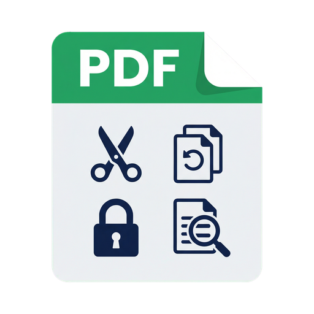

# PDFApps

> PDF editor and manager for Windows, macOS and Linux — fast, offline and subscription-free.

<p align="center">
  
</p>

[](https://nelsonduarte.github.io/PDFApps/)

[](https://github.com/nelsonduarte/PDFApps/releases/latest)
[](https://github.com/nelsonduarte/PDFApps/releases)
[](https://github.com/nelsonduarte/PDFApps/actions)
[](https://github.com/nelsonduarte/PDFApps/stargazers)
[](https://www.python.org/)
[](https://doc.qt.io/qtforpython/)
[](#)
[](LICENSE)
[](https://github.com/sponsors/nelsonduarte)
[](https://hypercommit.com/PDFapps)

---

## Why PDFApps?

Most PDF tools are either paid, browser-based, or require uploading your files to the cloud. **PDFApps** is different:

- **100% offline** — your files never leave your computer
- **No subscriptions** — free and open source, forever
- **All-in-one** — 13 tools: split, merge, compress, encrypt, OCR, convert, edit and more in a single app
- **Cross-platform** — works on Windows, macOS and Linux
- **Fast** — lazy rendering opens large PDFs instantly
- **Multi-language** — auto-detects your system language (EN, PT, ES, FR, DE, ZH, IT, NL)

---

## Screenshots

<p align="center">
  
  <br><em>Integrated PDF viewer with continuous scroll and lazy rendering</em>
</p>

<p align="center">
  
  <br><em>Visual PDF editor — redact, insert text, images, highlights and notes</em>
</p>

<p align="center">
  
  <br><em>All-in-one PDF tools — split, merge, compress, encrypt, OCR and more</em>
</p>

<p align="center">
  
  <br><em>Light theme support</em>
</p>

---

## Features

| Tool | Description |
|---|---|
| **Split** | Split the PDF into multiple files by user-defined page ranges |
| **Merge** | Combine multiple PDFs (drag and drop) into a single output, with free ordering |
| **Rotate** | Rotate individual pages or the entire document at any angle |
| **Extract pages** | Export a subset of pages to a new PDF |
| **Reorder** | Drag-and-drop interface to reorder or remove pages with preview |
| **Compress** | Reduce file size with three compression levels (extreme / recommended / low) |
| **Encrypt** | Protect the PDF with a password or remove existing protection |
| **Watermark** | Overlay a watermark/stamp PDF on pages with opacity and position control |
| **OCR** | Recognise text in scanned PDFs — supports PT, EN, ES, FR and DE |
| **Convert** | Convert PDF to images (PNG/JPG with DPI control), Word (DOCX) or plain text (TXT) |
| **Edit** | Inline visual editor: redact, insert text, image, highlight, notes, forms and edit existing text |
| **Import** | Convert text files (.txt), images (PNG/JPG/BMP) or Markdown (.md) to PDF — batch support |
| **Info** | Show metadata, page count, size and document properties |

### Integrated viewer

- **Print** — print any open PDF via system print dialog with high-resolution rendering
- **Tabbed viewing** — open multiple PDFs in tabs, switch between them
- Continuous scroll through all pages (Adobe Acrobat style)
- **Lazy rendering** — opens instantly; pages rendered in background as they are viewed
- **PDF search (Ctrl+F)** — search bar with live highlights and navigation between matches
- Zoom with Ctrl+scroll or toolbar buttons
- **Page navigation** — jump to any page via input field or prev/next buttons
- Text selection and copy by dragging
- **Comment popups** — view and delete annotations with pencil icons and balloon popups
- Password-protected PDF support
- Drag & drop file support

### Editor

- **Undo/Redo** — Ctrl+Z / Ctrl+Y with full action history
- **Password confirmation** — retype password when encrypting PDFs
- Redact, insert text, images, highlights, notes, forms and edit existing text

### Other highlights

- **Auto-update** — checks for new versions on startup; download and install updates in-app with progress bar
- **Multi-language** — auto-detects system language (EN, PT, ES, FR, DE, ZH, IT, NL), with selector in toolbar
- **Localized installer** — installer and uninstaller detect the OS language and display in the user's language
- **Recent files** — quick access to the last 10 opened PDFs via history icon
- **Help guide** — ? button opens the online user guide
- Modern dark/light theme with collapsible sidebar
- Full drag and drop support across all file fields
- Cross-platform: Windows, macOS and Linux
- Installer with automatic OCR engine (Tesseract) and Ghostscript detection and installation

---

## Getting started

### Download

| Platform | How to get it |
|---|---|
| **Windows** 10/11 64-bit | Download `PDFAppsSetup.exe` from [Releases](https://github.com/nelsonduarte/PDFApps/releases/latest) |
| **macOS** 10.14+ | Build from source (see below) — Tesseract via `brew install tesseract tesseract-lang` |
| **Linux** | Build from source (see below) — Tesseract via `sudo apt install tesseract-ocr` |

### Run from source

```bash
# Clone the repository
git clone https://github.com/nelsonduarte/PDFApps.git
cd PDFApps

# Create virtual environment
python -m venv venv

# Activate — Windows
venv\Scripts\activate
# Activate — macOS / Linux
source venv/bin/activate

# Install dependencies
pip install -r requirements.txt

# Run
python pdfapps.py
```

> **Tesseract OCR** is required for text recognition:
> - **Windows**: the installer handles this automatically
> - **macOS**: `brew install tesseract tesseract-lang`
> - **Linux**: `sudo apt install tesseract-ocr tesseract-ocr-por tesseract-ocr-eng`

---

## Build

The build process generates three executables in the `dist/` folder:

```bash
# 1. Main application
python -m PyInstaller --clean pdfapps.spec

# 2. Uninstaller
python -m PyInstaller --clean uninstaller.spec

# 3. Installer (bundles the two above)
python -m PyInstaller --clean installer.spec
```

| File | Description |
|---|---|
| `dist/PDFApps.exe` | Main application (~82 MB) |
| `dist/PDFAppsUninstall.exe` | Standalone uninstaller (~11 MB) |
| `dist/PDFAppsSetup.exe` | **Installer for distribution** (~104 MB) |

> PyInstaller does not cross-compile — the binary must be built on the target platform.

---

## Tech stack

| Component | Technology | Version |
|---|---|---|
| GUI | [PySide6](https://doc.qt.io/qtforpython/) (Qt 6) | 6.10.2 |
| PDF rendering | [PyMuPDF](https://pymupdf.readthedocs.io/) (fitz) | 1.27.2 |
| PDF manipulation | [pypdf](https://pypdf.readthedocs.io/) | 6.8.0 |
| OCR | [Tesseract](https://github.com/tesseract-ocr/tesseract) + [pytesseract](https://github.com/madmaze/pytesseract) | 0.3.13 |
| DOCX export | [python-docx](https://python-docx.readthedocs.io/) | 1.2.0 |
| Image processing | [Pillow](https://python-pillow.org/) | 12.1.1 |
| Icons | [QtAwesome](https://github.com/spyder-ide/qtawesome) | 1.4.1 |
| Packaging | [PyInstaller](https://pyinstaller.org/) | 6.19.0 |

---

## Project structure

```
PDFApps/
├── pdfapps.py              # Application entry point
├── installer.py            # Installer (tkinter UI, 8 languages)
├── uninstaller.py          # Uninstaller (8 languages)
├── pdfapps.spec            # PyInstaller config — app
├── installer.spec          # PyInstaller config — installer
├── uninstaller.spec        # PyInstaller config — uninstaller
├── icon.ico                # Application icon (multi-size, square)
├── icon_512.png            # Source icon (512x512 PNG)
├── pdfapps.svg             # Logo SVG (used in sidebar/viewer)
├── requirements.txt        # Python dependencies
├── docs/                   # GitHub Pages website
│   ├── index.html          # Single-page site with JS-based i18n
│   ├── icon.png            # App icon for website
│   └── favicon.ico         # Browser favicon
├── app/                    # Modular source code
│   ├── constants.py        # Colours and design constants
│   ├── styles.py           # Qt stylesheet (dark/light theme)
│   ├── utils.py            # Shared utilities
│   ├── widgets.py          # Reusable widgets (DropFileEdit, etc.)
│   ├── base.py             # Base class for tools (BasePage)
│   ├── i18n.py             # Internationalization module (8 languages)
│   ├── translations.json   # All translated UI strings
│   ├── updater.py          # Auto-updater (GitHub releases)
│   ├── window.py           # Main window (MainWindow)
│   ├── tools/              # PDF manipulation tools
│   │   ├── split.py
│   │   ├── merge.py
│   │   ├── rotate.py
│   │   ├── extract.py
│   │   ├── reorder.py
│   │   ├── compress.py
│   │   ├── encrypt.py
│   │   ├── watermark.py
│   │   ├── convert.py
│   │   ├── import_pdf.py
│   │   ├── info.py
│   │   └── ocr.py
│   ├── viewer/             # Integrated PDF viewer
│   │   ├── canvas.py       # Lazy page rendering in background threads (fitz)
│   │   └── panel.py        # Viewer panel with controls
│   └── editor/             # Visual PDF editor
│       ├── canvas.py       # Edit canvas (PdfEditCanvas)
│       ├── tab.py          # Edit tab (TabEditar)
│       └── dialogs.py      # Auxiliary dialogs
└── dist/                   # Generated executables (after build)
```

---

## Contributing

Contributions are welcome! Feel free to open issues or submit pull requests.

---

## Support the project

If you find PDFApps useful, consider [sponsoring the project](https://github.com/sponsors/nelsonduarte) to help keep it alive and growing.

<a href="https://github.com/sponsors/nelsonduarte">
  
</a>

### Sponsors

<!-- gold -->
<!-- Add your logo here by sponsoring at the Gold tier -->

#### Gold sponsors

_Be the first Gold sponsor — [become one](https://github.com/sponsors/nelsonduarte)_

#### Backers

_Be the first Backer — [become one](https://github.com/sponsors/nelsonduarte)_

#### Supporters

_Be the first Supporter — [become one](https://github.com/sponsors/nelsonduarte)_

---

## License

This project is licensed under the [MIT License](LICENSE).
